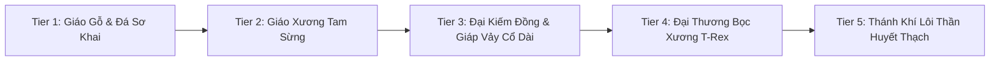

# 🏛️ TÀI LIỆU THIẾT KẾ TRÒ CHƠI TOÀN DIỆN (GAME DESIGN DOCUMENT)
# DỰ ÁN: KỶ NGUYÊN HOANG CỔ (THE PRIMEVAL ERA)
### *Phiên bản: 2.5 — Lead Game Designer & Technical Narrative Director Edition*

---

## 📑 MỤC LỤC CHI TIẾT
1. [Tổng Quan Dự Án & Tầm Nhìn Nghệ Thuật (Project Overview & Vision)](#1-tổng-quan-dự-án--tầm-nhìn-nghệ-thuật)
2. [Danh Mục Tài Nguyên 3D & Phân Vai Gameplay (3D Asset Mapping)](#2-danh-mục-tài-nguyên-3d--phân-vai-gameplay)
3. [Thế Giới Quan & Đại Biên Niên Sử (World Lore & Cosmology)](#3-thế-giới-quan--đại-biên-niên-sử)
4. [Chiến Dịch Săn Thú 5 Chương & Lộ Trình 90 Ngày Phá Đảo (3-Month Progression Campaign)](#4-chiến-dịch-săn-thú-5-chương--lộ-trình-90-ngày-phá-đảo)
5. [Hệ Thống Nông Nghiệp Hậu Cần & 4 Trụ Cột Tài Nguyên (Age of Empires Logistics)](#5-hệ-thống-nông-nghiệp-hậu-cần--4-trụ-cột-tài-nguyên)
6. [Hệ Thống Dân Làng Tự Động Hóa & Cân Bằng Kinh Tế (Villager Automation & Anti-Speedrun Math)](#6-hệ-thống-dân-làng-tự-động-hóa--cân-bằng-kinh-tế)
7. [Cây Tiến Hóa Trang Bị & Thần Binh 5 Tier (Equipment & Weapon Tech Tree)](#7-cây-tiến-hóa-trang-bị--thần-binh-5-tier)
8. [Kiến Trúc Dữ Liệu & Code Schema Chuẩn ES6 (Technical Architecture)](#8-kiến-trúc-dữ-liệu--code-schema)

---

## 1. TỔNG QUAN DỰ ÁN & TẦM NHÌN NGHỆ THUẬT

```
                                  KỶ NGUYÊN HOANG CỔ
                   ┌───────────────────────┴───────────────────────┐
                   ▼                                               ▼
         [CHIẾN ĐẤU & SINH TỒN]                          [XÂY DỰNG & ĐIỀU PHỐI]
        • Monster Hunter / Valheim                      • Age of Empires (Đế Chế)
        • Đòn đánh uy lực, lướt né                      • 4 Trụ cột tài nguyên: Thịt, Gỗ, Đá, Thuốc
        • 5 Tầng trang bị Thần Khí                      • Quản lý dân làng tự động & Pháo đài
```

### 1.1. Định Vị Thể Loại (Genre DNA)
**Kỷ Nguyên Hoang Cổ (The Primeval Era)** là tựa game kết hợp đột phá giữa **3D Open-World Isometric Prehistoric Survival Action-RPG** và **Base-Building RTS (Age of Empires)**. 
Người chơi vừa là một Dũng sĩ trực tiếp cầm giáo săn bắt khủng long hung hãn thời tiền sử, vừa là Tù trưởng lãnh đạo xây dựng bộ tộc, điều phối dân làng khai khoáng, trồng trọt và dựng pháo đài đẩy lùi những đợt tiến công đẫm máu trong Đêm Trăng Máu (*Blood Moon*).

### 1.2. Phong Cách Nghệ Thuật & Góc Nhìn (Art Direction & Camera)
* **Góc nhìn (Perspective):** Isometric $45^\circ$ cố định góc chiếu từ trên xuống, camera theo dõi mượt mà (`lerp factor = 0.08`), tạo tầm nhìn chiến thuật bao quát toàn cảnh tiền đồn và dã thú xung quanh.
* **Phong cách đồ họa (Visual Style):** 3D Stylized PBR (Low/Mid-Poly cao cấp kết hợp ánh sáng vật lý chân thực, bề mặt kim loại, thô ráp của đá và da thuộc thời cổ xưa).
* **Nền tảng kỹ thuật cốt lõi:**
  * Three.js (WebGL r128), HTML5 Canvas Overlay, CSS3 High-Performance Glassmorphism HUD.
  * Toàn bộ tài nguyên 3D (`.glb`, `.fbx`), âm thanh tổng hợp (Web Audio Synthesizer) và cơ sở dữ liệu được lưu trữ cục bộ (Offline-First Architecture).

---

## 2. DANH MỤC TÀI NGUYÊN 3D & PHÂN VAI GAMEPLAY

Toàn bộ 16 bộ mô hình 3D trong thư mục `models/` được ánh xạ chuẩn xác vào vòng lặp lối chơi:

| STT | Tên Asset File | Phân Loại | Vai Trò Chức Năng Gameplay | Chỉ Số / Tương Tác |
| :--- | :--- | :--- | :--- | :--- |
| **1** | `warrior_idle/walk/attack/death/picking_up/hit_reaction.fbx` | Nhân Vật | Dũng Sĩ Nam (Modular 6 Hoạt Ảnh FBX) | Vũ khí cơ bản: Giáo Gỗ. Tốc độ cơ sở: $3.8\,\text{m/s}$. |
| **2** | `female_warrior_...fbx` | Nhân Vật | Dũng Sĩ Nữ (Modular 6 Hoạt Ảnh FBX) | Nhanh nhẹn, hoán đổi linh hoạt phím $G$. |
| **3** | `trex.glb` | Dã Thú (Apex Boss) | **Đại Bạo Long T-Rex:** Chúa tể thung lũng, trùm cuối của lộ trình 90 ngày. | Máu: $1500$, Sát thương: $42$, Rớt Huyết Ngọc & Đại Xương. |
| **4** | `Triceratops.glb` | Dã Thú (Heavy Tank) | **Khủng Long Tam Sừng:** Dã thú hộ vệ vùng thảo nguyên, húc văng công trình. | Máu: $650$, Sát thương: $22$, Cung cấp Sừng Cứng (Tier 2). |
| **5** | `Apatosaurus.glb` | Dã Thú (Colossus) | **Khủng Long Cổ Dài:** Khổng lồ hiền hòa, cung cấp lượng thịt và da thuộc khổng lồ. | Máu: $1200$, Cung cấp $12$ Thịt sống & Giáp Vảy Cổ Dài. |
| **6** | `Velociraptor.glb` | Dã Thú (Pack Hunter) | **Raptor Nhanh Nhẹn:** Săn mồi theo bầy 2-3 con, chuyên tập kích dân làng. | Máu: $220$, Tốc độ: $6.2\,\text{m/s}$, Rớt Nanh Sắc & Da Thú. |
| **7** | `Stegosaurus.glb` | Dã Thú (Defender) | **Khủng Long Gai Kiếm:** Dã thú vùng đầm lầy, đòn quật đuôi gây choáng diện rộng. | Máu: $550$, Giáp gai đúc Khiên Phản Đòn. |
| **8** | `Parasaurolophus.glb` | Dã Thú (Scout) | **Khủng Long Mào:** Thú ăn cỏ nhút nhát, tiếng kêu báo động xua đuổi dã thú nhỏ. | Máu: $300$, Tốc độ chạy trốn cao, cung cấp Gân Thú dai. |
| **9** | `animated_flying_pteradactal.glb` | Dã Thú (Aerial) | **Dực Long Bay Liệng:** Tuần thám trên không độ cao $14\text{m}$, sà xuống quắp tài nguyên. | Bay theo quỹ đạo elip, quan sát chuyển động thời tiết. |
| **10** | `stylized_palm_tree.glb` | Môi Trường | **Cây Cọ Cổ Thụ:** Chắn gió bão, cung cấp Gỗ Thượng Hạng khi đốn hạ. | Trữ lượng: $15$ Gỗ / cây. Tái sinh sau 3 ngày. |
| **11** | `fallen_stump.glb` | Thu Thập | **Khúc Gỗ Mục:** Cung cấp Cành Cây Khô ($+1\text{ Wood}$) cho giai đoạn đầu game. | Thu hoạch nhanh bằng tay (`pickupAction` $1.35\times$). |
| **12** | `tree_stump.glb` | Thu Thập | **Gốc Cây Già:** Môi trường mọc nấm tự nhiên sau mỗi cơn mưa rào. | Thu hoạch $2\times$ Nấm sau ngày mưa. |
| **13** | `stylized_rock.glb` | Môi Trường | **Khối Cự Thạch:** Địa hình che chắn tầm nhìn của thú ăn thịt, mỏ khai khoáng đá tảng. | Trữ lượng: $30$ Đá, cần Búa Đục Đá. |
| **14** | `stylized_stones_minipack.glb` | Thu Thập | **Đá Nhọn Rải Rác:** Cung cấp Đá Thô ($+1\text{ Stone}$) chế tác rìu, giáo sơ cấp. | Tái sinh ngẫu nhiên khắp bán kính $40\text{m}$. |
| **15** | `low_poly_mushroom_pack.glb` | Thu Thập | **Cụm Nấm Rừng:** Thực phẩm sinh tồn khẩn cấp, nguyên liệu bào chế thuốc giải độc. | Hồi phục $+15$ Độ No, $+5$ Thể Lực. |
| **16** | `anemone_flower / generic_ranunculus / peace_lily.glb` | Thu Thập | **Thảo Dược Cổ Đại (Hoa Anemone, Ranunculus, Lily):** Bào chế Thần Dược Hồi Máu & Thuốc Trợ Lực. | Hồi phục $+35$ HP & giải nhiệt mùa khô. |

---

## 3. THẾ GIỚI QUAN & ĐẠI BIÊN NIÊN SỬ

```
                             KHỞI THỦY: NĂNG LƯỢNG HUYẾT THẠCH
                                           │
                                           ▼
                     KỶ BÙNG NỔ SINH HỌC & ĐẾ CHẾ CỔ THẠCH TỘC
                                           │
                                           ▼
               THẢM HỌA THIÊN THẠCH VÀ SỰ TRỖI DẬY CỦA BẠO CHÚA T-REX
                    (Màn Sương Đỏ FogExp2 & Lời Nguyền Trăng Máu)
                                           │
                                           ▼
                 TIỀN ĐỒN KHỞI NGUYÊN & SỨ MỆNH PHỤC HƯNG 90 NGÀY
```

### 3.1. Nguồn Gốc Huyết Thạch (Primeval Bloodstone)
Hàng vạn năm trước, một thiên thể mang lõi **Huyết Thạch** va chạm vào trung tâm đại lục Pangaea nguyên thủy. Bức xạ năng lượng sự sống cô đặc từ mảnh vỡ Huyết Thạch đã kích hoạt quá trình đột biến sinh học siêu tốc: cỏ cây phát triển khổng lồ, muôn thú hóa thành những loài bò sát khổng lồ sở hữu lớp giáp bất hoại, và **Cổ Thạch Tộc** — nền văn minh loài người đầu tiên — ra đời với khả năng rèn đúc năng lượng vào đá và xương thú.

### 3.2. Sự Sụp Đổ & Màn Sương Đỏ (The Fall & Blood Mist)
Tham vọng khai thác vô độ đã khiến Lõi Huyết Thạch phát nổ. Bụi đỏ phóng xạ phủ kín bầu trời, tạo nên **Màn Sương Cổ Đại (`THREE.FogExp2`)** giam cầm đại lục. Những cá thể dã thú mạnh nhất bị tha hóa thành ác thú cuồng sát, dẫn đầu bởi **Đại Bạo Long T-Rex (Alpha Tyrant)**. Nền văn minh Cổ Thạch Tộc bị xóa sổ, chỉ còn lại những phế tích cự thạch Stonehenge vùi trong cát bụi.

### 3.3. Thân Phận Người Chơi & Lời Nguyền Trăng Máu
Người chơi nhập vai người sống sót cuối cùng mang trong mình dòng máu **Huyết Cổ Ngữ**. Thức tỉnh bên ngọn lửa tàn của **Tiền Đồn Khởi Nguyên**, bạn mang trên vai sứ mệnh:
1. Xây dựng lại tiền đồn từ tàn tro, quy tụ dân làng lưu tán.
2. Thiết lập chuỗi nông nghiệp và công xưởng rèn đúc thần binh.
3. Sinh tồn qua 12 Đêm Trăng Máu thanh trừng.
4. Tổng tiến công hang ổ Xích Thạch, đả bại Bạo Chúa T-Rex và giải phóng màn sương đại lục.

---

## 4. CHIẾN DỊCH SĂN THÚ 5 CHƯƠNG & LỘ TRÌNH 90 NGÀY PHÁ ĐẢO

Lộ trình được thiết kế chính xác theo cấu trúc 3 Tháng thực tế trong game (mỗi ngày game kéo dài tương ứng chu kỳ thời gian thực, có cơ chế thời tiết bám sát 4 mùa):

```mermaid
gantt
    title LỘ TRÌNH CHIẾN DỊCH PHÁ ĐẢO 90 NGÀY (3 THÁNG)
    dateFormat  X
    axisFormat Ngày %s
    section Tháng 1: Tự Lực Cánh Sinh
    Chương 1 - Tiền Đồn Tro Tàn        :active, 0, 15
    Chương 2 - Bầy Raptor Rình Rập     : 15, 30
    section Tháng 2: Khai Hoang & Đồ Đồng
    Chương 3 - Chế Ngự Khổng Lồ        : 30, 45
    Chương 4 - Pháo Đài Đồ Đồng        : 45, 60
    section Tháng 3: Đồ Long Phục Hưng
    Chương 5 - Đại Chiến Huyết Long    : 60, 90
```



### 4.1. Chi Tiết Tiến Trình Từng Giai Đoạn

#### 🗓️ THÁNG 1: KỶ NGUYÊN TỰ LỰC CÁNH SINH (Ngày 1 ➔ Ngày 30 | Đời I ➔ Đời II)
* **Mục tiêu:** Dựng lại Trại Lửa Khởi Nguyên, giải cứu 3 Dân Làng đầu tiên, đắp hàng rào cọc gỗ.
* **Trải nghiệm chiến đấu:**
  * Vũ khí: Giáo Gỗ thô sơ ($15\,\text{ATK}$) $\rightarrow$ Giáo Bọc Đá Nhọn ($28\,\text{ATK}$).
  * Kẻ thù: Bầy Velociraptor nhỏ lẻ ($220\,\text{HP}$) quấy nhiễu nguồn nước và kho lương.
* **Mốc chuyển giao (Ngày 30 - Boss Đêm Trăng Máu 1):** Thủ lĩnh bầy Raptor (Alpha Raptor - $500\,\text{HP}$). Tiêu diệt xong mở khóa công thức Nhà Chính Cấp 2.

#### 🗓️ THÁNG 2: KỶ NGUYÊN KHAI HOANG & ĐỒ ĐỒNG (Ngày 31 ➔ Ngày 60 | Đời II ➔ Đời III)
* **Mục tiêu:** Mở rộng dân số lên 7 người. Xây dựng Lò Rèn Thợ Rèn Kra, Giàn Hun Khói Thịt, Chòi Bắn Nỏ Tự Động.
* **Trải nghiệm chiến đấu:**
  * Vũ khí: Đại Giáo Xương Tam Sừng ($52\,\text{ATK}$, nội tại Xuyên Giáp $25\%$) & Giáp Da Thuộc Apatosaurus ($+150\,\text{Max HP}$).
  * Kẻ thù: Triceratops điên loạn phá hoại nông trại; Dực Long Pteranodon tập kích kho cá trên không.
* **Mốc chuyển giao (Ngày 60 - Boss Trăng Máu 2):** Cặp đôi Bạo Giáp Stegosaurus & Cổ Dài Hắc Hóa. Phần thưởng: Mở khóa Công nghệ Luyện Đồng Cổ.

#### 🗓️ THÁNG 3: KỶ NGUYÊN ĐẠI PHÁO ĐÀI & ĐỒ LONG (Ngày 61 ➔ Ngày 90 | Đời III ➔ Đời IV)
* **Mục tiêu:** Vận hành tối đa 12 dân làng tự động hóa hoàn toàn. Giải mã trận đồ Cự Thạch Stonehenge, đúc **Đại Giáo Thần Binh Huyết Thạch Tier 5**.
* **Đại Chiến Ngày 90 (The Final Cataclysm):**
  * **Trùm Cuối: Hoàng Đế Bạo Long T-Rex ($1500\,\text{HP}$, 3 Phase biến hình cuồng nộ):**
    * *Phase 1 (100% - 60% HP):* Cắn xé dồn dập, gầm thét làm giảm $50\%$ tốc độ di chuyển của người chơi.
    * *Phase 2 (60% - 20% HP):* Hút năng lượng Huyết Thạch triệu hồi bầy Raptor cảm tử, dậm chân gây địa chấn toàn bản đồ.
    * *Phase 3 (20% - 0% HP):* Hóa Đỏ Cuồng Bạo, tốc độ di chuyển tăng $1.4\times$, đòn cắn kết liễu nếu dũng sĩ không lướt né kịp thời.
* **Kết màn:** T-Rex gục ngã, lõi Huyết Thạch được thanh tẩy, Màn sương đỏ tan biến, mở ra **Chế Độ Vô Tận (Endless Sandbox Empire)**.

### 4.2. Thiết Kế Vòng Lặp 1 - 2 Giờ Mỗi Ngày & Cơ Chế Lợi Nhuận Giảm Dần (Daily Loop & Soft-Cap Economics)

Để đảm bảo người chơi **chơi 1 - 2 tiếng mỗi ngày là đạt hiệu quả tối đa**, cày thêm chỉ nhận được lượng tài nguyên không đáng kể và **buộc phải trải qua đủ 3 tháng (90 ngày) mới phá đảo**, hệ thống áp dụng cơ chế điều phối nhịp độ 3 tầng:

```
                            CẤU TRÚC 1 SESSION CHƠI (60 - 90 PHÚT/NGÀY)
  ┌──────────────────┬─────────────────────────────┬──────────────────────────┬──────────────────┐
  │   0 - 15 PHÚT    │        15 - 45 PHÚT         │       45 - 75 PHÚT       │   75 - 90 PHÚT   │
  │ • Thu hoạch kho  │ • Hoàn thành 4 Nhiệm Vụ     │ • Tiêu Thể Lực Săn Thú   │ • Nâng cấp trại  │
  │ • Phân việc dân  │ • Nhận 70% EXP & Đồng Vàng  │ • Săn 1-2 Khủng Long Lớn │ • Rèn trang bị   │
  │ • Nấu ăn sưởi ấm │ • Thu gom mỏ Tươi (100%)    │ • Thu thập Nanh/Vảy/Sừng │ • Phòng thủ Đêm  │
  └──────────────────┴─────────────────────────────┴──────────────────────────┴──────────────────┘
```

#### 1. Bộ 4 Nhiệm Vụ Nhật Trình (Daily Tribal Decrees)
Mỗi ngày vào lúc 00:00 (hoặc khi bắt đầu ngày mới), Trưởng Lão Elder Mo ban hành **4 Nhiệm vụ Ngày ngẫu nhiên**, hoàn thành trong khoảng **30–45 phút**, mang lại **$70\%$ lượng tiến trình phát triển của cả ngày**:
* **Nhiệm vụ Thu hoạch (Harvest Decree):** Thu thập $15$ Gỗ Cọ / $10$ Đá Nhọn / $5$ Thảo Dược tươi.
* **Nhiệm vụ Săn Bắn (Hunting Decree):** Đẩy lùi $2$ đợt tuần tra Raptor hoặc săn $1$ Khủng long lớn.
* **Nhiệm vụ Hậu cần (Logistics Decree):** Hun khói $10$ miếng thịt sống hoặc rèn $1$ công cụ mới cho dân làng.
* **Nhiệm vụ Thám hiểm (Scout Decree):** Khám phá 1 phế tích Cự Thạch hoặc thắp sáng 3 ngọn đuốc ven biên giới.

#### 2. Cơ Chế Lợi Nhuận Giảm Dần (Diminishing Returns Formula - Soft-Cap)
Khi người chơi chơi vượt quá ngưỡng thời gian vàng ($> 90\text{ – }120\,\text{phút}$ trong ngày), hệ thống tự động kích hoạt trạng thái **"Mỏ Cạn Kiệt" (Depleted State)**:

$$\text{Tỉ lệ rơi đồ (Drop Rate)} = \begin{cases} 
100\% & \text{khi } T_{\text{play}} \le 90 \text{ phút (Khung Giờ Vàng)} \\
20\% & \text{khi } 90 < T_{\text{play}} \le 120 \text{ phút} \\
5\% & \text{khi } T_{\text{play}} > 120 \text{ phút (Mỏ cạn kiệt)}
\end{cases}$$

* **Hệ quả kinh tế:** Sau 2 tiếng, nếu người chơi tiếp tục cày cuốc 5–6 tiếng nữa thì tổng tài nguyên thu được **chỉ bằng 10–15 phút chơi trong Khung Giờ Vàng**.
* **Nguyên liệu cốt lõi (Core Mats):** Nanh Bạo Long, Sừng Tam Sừng, Quặng Đồng Cổ và Huyết Ngọc **hoàn toàn KHÔNG RƠI THÊM** sau khi đã dùng hết hạn ngạch săn bắn trong ngày (Daily Hunt Quota: $2\text{ con Boss/ngày}$).

#### 3. Bộ 3 Khóa Cổng Thời Gian Tự Nhiên (Natural Time-Gating Pillars)
1. **Nghi Thức Trăng Máu (Weekly Blood Moon Gates):** 12 Đêm Trăng Máu xuất hiện cố định mỗi 7 ngày. Mỗi đợt Trăng Máu mở khóa $1$ Tầng Nghi Thức. Phải đủ 12 Tầng Nghi Thức (tương đương **tuần thứ 12 / Ngày 84–90**) mới có thể mở cánh cổng tiến vào Hang Bạo Long Hoàng Đế.
2. **Thời Gian Nung Luyện Thần Binh (Real-Time Forge Cooling):** Các món trang bị Tier 3, 4, 5 đòi hỏi thời gian tôi luyện trong lò rèn từ $24\text{h} \rightarrow 48\text{h}$ thời gian thực mới hoàn tất.
3. **Giải Mã Huyết Cổ Ngữ (Blood Rune Decryption):** Mỗi ngày Trưởng Lão chỉ giải mã được $1$ Cổ Ngữ từ các phiến đá. Người chơi cần tích lũy đủ $80\text{ Cổ Ngữ}$ (sau gần 3 tháng) để vô hiệu hóa Hào Quang Bất Hoại của Trùm Cuối T-Rex.

## 5. HỆ THỐNG NÔNG NGHIỆP HẬU CẦN & 4 TRỤ CỘT TÀI NGUYÊN

Kế thừa cơ chế chiều sâu kinh tế của dòng game *Age of Empires (Đế Chế)*, tài nguyên được chia thành **4 Trụ Cột Độc Lập**:

```
                       ┌───────────────────────────────────────┐
                       │        4 TRỤ CỘT TÀI NGUYÊN           │
                       └───────────────────┬───────────────────┘
         ┌──────────────────┬──────────────┴─────┬──────────────────┐
         ▼                  ▼                    ▼                  ▼
    🥩 THỰC PHẨM        🪵 GỖ RỪNG          🪨 ĐÁ & QUẶNG       🌿 DƯỢC LIỆU
 • Nuôi sống dân     • Dựng nhà, chòi     • Đắp tường đá      • Bào chế thuốc
 • Duy trì thể lực   • Rèn cán giáo       • Đúc lò rèn        • Tăng cường sinh lực
 • Nâng cấp Đời      • Nổi lửa sưởi ấm    • Nâng cấp vũ khí   • Giải độc sương mù
```

### 5.1. Bảng Chi Tiết 4 Trụ Cột Tài Nguyên
1. **🥩 Thực Phẩm (Food):** Nguồn sống quyết định quy mô bộ tộc. Thu được từ hái Nấm, bẫy Cá, săn Khủng long lấy Thịt sống rồi hun khói thành Thịt chín bảo quản lâu ngày.
2. **🪵 Gỗ Rừng (Wood):** Khai thác từ Cây Cọ Cổ Thụ và Cành Gỗ Mục. Dùng để dựng Lều Tranh, Nhà Chính, Tháp Canh Nỏ và làm củi lửa xua đuổi dã thú ban đêm.
3. **🪨 Đá & Kim Loại (Stone & Ore):** Thu thập từ Đá Nhọn và Khối Cự Thạch. Dùng để xây Tường Thành, Lò Rèn, đúc mũi giáo và khiên chắn.
4. **🌿 Thảo Dược & Hoa Quý (Herbs & Flora):** Thu hái từ Hoa Anemone, Ranunculus, Peace Lily. Dùng để luyện chế Thần Dược Hồi Máu, Thuốc Trợ Lực và Bùa Chú Huyết Thạch.

### 5.2. Hệ Thống Tiền Tệ 3 Tầng
* 🦷 **Nanh Thú Cổ (Beast Fangs):** Tiền tệ sơ cấp qua trao đổi hàng đổi hàng với Thương Nhân Lưu Động.
* 🪙 **Đồng Vàng Cổ Đại (Ancient Gold Coins):** Tiền tệ giao thương chính thống giữa các tiền đồn, dùng thuê mướn thợ giỏi và mua bảo bối quý từ Trưởng Lão.
* 💎 **Huyết Ngọc Bạo Long (Tyrant Blood Gem):** Tinh thể năng lượng cực hiếm chỉ rơi khi hạ gục Khủng long Alpha và Trùm T-Rex, nguyên liệu duy nhất để đúc Thần Binh Tier 5.

### 5.3. Quy Hoạch Kiến Trúc Doanh Trại (Base Infrastructure)
* **Nhà Chính Bộ Tộc (Town Hall):** Trọng tâm căn cứ, quyết định Cấp Độ Kỷ Nguyên (Đời I ➔ Đời IV) và giới hạn dân số tối đa.
* **Kho Lương Thực & Hầm Giữ Nhiệt:** Chống hư hỏng thức ăn trong mùa nắng gắt hoặc mưa bão kéo dài.
* **Lò Rèn Thợ Rèn Kra:** Nơi nghiên cứu và tôi luyện các cấp bậc vũ khí, áo giáp.
* **Giàn Hun Khói Thịt:** Tự động chuyển hóa $10\,\text{Thịt Sống} \rightarrow 10\,\text{Thịt Chín} + 2\,\text{Da Thuộc}$ sau mỗi $5$ phút.
* **Tháp Canh Bắn Nỏ Tự Động:** Tầm bắn $18\text{m}$, tự động bắn tiễn đá ngăn chặn Raptor đột kích.

---

## 6. HỆ THỐNG DÂN LÀNG TỰ ĐỘNG HÓA & CÂN BẰNG KINH TẾ

```
                          NHÀ CHÍNH BỘ TỘC (TOWN HALL)
                                       │
                ┌──────────────────────┼──────────────────────┐
                ▼                      ▼                      ▼
           🪓 TIỀU PHU            ⛏️ THỢ MỎ              🧪 DƯỢC SĨ
        (Chặt gỗ tự động)     (Đập đá & quặng)       (Hái hoa & bào chế)
                │                      │                      │
                └──────────────────────┼──────────────────────┘
                                       ▼
                              🛡️ DÂN BINH TUẦN THÁM
                           (Canh gác & bảo vệ trại)
```

### 6.1. 4 Nghề Nghiệp Dân Làng (Villager Roles)
* 🪓 **Tiều Phu (Lumberjack):** Tự động tìm kiếm cây cọ, khúc gỗ mục gần căn cứ để chặt lấy Gỗ chuyển về kho ($+12\,\text{Wood / phút}$).
* ⛏️ **Thợ Mỏ (Miner):** Khai khoáng các bãi đá nhọn và vỉa cự thạch ($+8\,\text{Stone / phút}$).
* 🧪 **Dược Sĩ / Hái Lượm (Forager):** Thu thập nấm và hoa thảo dược, tự động chế tạo Thuốc Hồi Máu dự trữ ($+4\,\text{Herbs / phút}$).
* 🛡️ **Dân Binh / Thợ Săn (Guard & Hunter):** Đứng canh tại tháp gác hoặc tuần tra lối vào tiền đồn, tự động tấn công dã thú xâm phạm trong phạm vi $15\text{m}$.

### 6.2. Cơ Chế Chống Phá Đảo Nhanh (Anti-Speedrun Mathematical Balance)

Để đảm bảo trải nghiệm chơi sâu sắc suốt 90 ngày và không bị lạm phát tài nguyên, hệ thống áp dụng các công thức kinh tế nghiêm ngặt:

#### 1. Giới Hạn Dân Số Theo Kỷ Nguyên (Strict Population Cap)
$$\text{Max Population} = \begin{cases} 
3 \text{ Dân} & \text{ở Đời I (Lều Tranh)} \\
7 \text{ Dân} & \text{ở Đời II (Doanh Trại Gỗ)} \\
12 \text{ Dân} & \text{ở Đời III - IV (Đại Pháo Đài Đá)}
\end{cases}$$

#### 2. Chi Phí Lương Thực Duy Trì (Food Upkeep Formula)
Mỗi dân làng tiêu thụ thực phẩm theo thời gian thực để duy trì sự sống:
$$\Delta \text{Food}_{\text{consume}} = -1.0 \times \text{Population Count} \quad (\text{đơn vị: Meat / phút})$$
> [!WARNING]
> **Hiện Tượng Đình Công & Đào Tẩu:** Nếu kho lương thực về $0$, toàn bộ dân làng sẽ ngừng làm việc (Đình công) và chỉ số HP giảm dần. Sau 15 phút bỏ đói, dân làng sẽ bỏ trốn khỏi bộ tộc.

#### 3. Hệ Số Hao Mòn Công Cụ (Tool Durability Decay)
Dân làng không thể khai thác vĩnh viễn bằng một chiếc rìu. Cứ sau mỗi $100$ đơn vị tài nguyên thu gom được, công cụ sẽ gãy hỏng, đòi hỏi kho phải có sẵn công cụ mới từ Lò Rèn để tiếp tục làm việc.

---

## 7. CÂY TIẾN HÓA TRANG BỊ & THẦN BINH 5 TIER

Hệ thống vũ khí được thiết kế 5 bậc tiến hóa rõ rệt, đem lại cảm giác tăng tiến sức mạnh vượt trội khi hạ gục từng loài dã thú tương ứng:



### 7.1. Bảng Thông Số Chi Tiết 5 Cấp Bậc Trang Bị

| Tier | Tên Vũ Khí / Trang Bị | Sát Thương (ATK) | Tốc Độ Đánh | Hiệu Ứng Đặc Biệt (Passive / Active) | Nguyên Liệu Chế Tác |
| :---: | :--- | :---: | :---: | :--- | :--- |
| **Tier 1** | **Giáo Gỗ Mũi Đá** | $25\,\text{ATK}$ | $1.0\times$ | Đòn chém cơ bản, phạm vi $2.0\text{m}$. | $10\,\text{Wood} + 5\,\text{Stone}$ |
| **Tier 2** | **Xuyên Vân Thương Tam Sừng** | $45\,\text{ATK}$ | $1.1\times$ | **Xuyên Giáp $25\%$:** Bỏ qua lớp sừng dày của thú ăn cỏ lớn. | $1\,\text{Triceratops Horn} + 30\,\text{Stone} + 200\,\text{Gold}$ |
| **Tier 3** | **Cự Kiếm Đồng & Giáp Apatosaurus** | $75\,\text{ATK}$ | $1.2\times$ | **Trọng Giáp Hộ Thể:** Tăng $+200\,\text{HP}$, giảm $30\%$ sát thương nhận vào. | $5\,\text{Apatosaurus Scale} + 50\,\text{Bronze} + 500\,\text{Gold}$ |
| **Tier 4** | **Đại Giáo Nanh Quỷ T-Rex** | $120\,\text{ATK}$ | $1.25\times$ | **Vết Thương Sâu:** Gây xuất huyết rút $15\,\text{HP/giây}$ trong 5s. | $2\,\text{T-Rex Fangs} + 10\,\text{Pelt} + 1000\,\text{Gold}$ |
| **Tier 5** | **Thánh Khí Lôi Thần Huyết Thạch** | $210\,\text{ATK}$ | $1.35\times$ | **Thiên Lôi Trừng Phạt:** Mỗi đòn đánh phóng ra tia sét lan 3 mục tiêu xung quanh. | $1\,\text{Tyrant Blood Gem} + 1\,\text{Tier 4 Spear} + 3000\,\text{Gold}$ |

---

## 8. KIẾN TRÚC DỮ LIỆU & CODE SCHEMA

Để lập trình viên sẵn sàng tích hợp trực tiếp vào Engine Three.js (`index.html`), dưới đây là cấu trúc State Objects hoàn chỉnh theo tiêu chuẩn ES6:

```javascript
/**
 * ARCHITECTURE SCHEMA: KỶ NGUYÊN HOANG CỔ (THE PRIMEVAL ERA)
 * Hệ thống Quản Lý Trạng Thái Toàn Diện
 */

// 1. TRẠNG THÁI TIỀN ĐỒN & KINH TẾ QUÂN SỰ (EMPIRE STATE)
const EmpireState = {
  tier: 1,                    // 1: Lều Tranh, 2: Doanh Trại Gỗ, 3: Pháo Đài Đá, 4: Đế Chế Cổ Thạch
  populationCap: 3,           // Giới hạn dân số theo Tier
  buildings: {
    townHall: { level: 1, hp: 1000, maxHp: 1000 },
    forge: { built: false, level: 0 },
    smoker: { built: false, level: 0 },
    crossbowTowers: [
      // { id: 'tower_1', x: 12, z: -8, hp: 400, target: null }
    ]
  },
  resources: {
    food: 20,                 // Thực phẩm (Thịt hun khói / nấm)
    wood: 15,                 // Gỗ rừng
    stone: 10,                // Đá & quặng
    herbs: 5                  // Thảo dược
  },
  currency: {
    fangs: 0,                 // Nanh thú cổ sơ cấp
    gold: 150,                // Đồng vàng cổ đại
    bloodGems: 0              // Huyết ngọc T-Rex tối thượng
  }
};

// 2. TRÌNH QUẢN LÝ DÂN LÀNG TỰ ĐỘNG (VILLAGER MANAGER)
const VillagerManager = {
  list: [
    {
      id: 'v_01',
      name: 'A-Mục',
      role: 'LUMBERJACK',     // 'LUMBERJACK' | 'MINER' | 'FORAGER' | 'GUARD'
      hp: 100,
      toolDurability: 100,    // 0 - 100%
      targetNode: null,       // Node tài nguyên đang khai thác
      mesh: null
    }
  ],
  
  // Công thức cập nhật chu kỳ lao động và tiêu hao lương thực
  tick(dt) {
    const totalVillagers = this.list.length;
    if (totalVillagers === 0) return;

    // Chi phí nuôi ăn: 1 Food / phút mỗi dân
    const foodUpkeepPerSec = totalVillagers / 60.0;
    EmpireState.resources.food = Math.max(0, EmpireState.resources.food - foodUpkeepPerSec * dt);

    const isStarving = EmpireState.resources.food <= 0;

    this.list.forEach((v) => {
      if (isStarving) {
        v.hp = Math.max(0, v.hp - dt * 1.5); // Bị đói mất máu
        return; // Dừng làm việc khi đói
      }

      // Khai thác tài nguyên theo nghề
      if (v.role === 'LUMBERJACK') {
        EmpireState.resources.wood += (12 / 60) * dt;
        v.toolDurability -= dt * 0.2;
      } else if (v.role === 'MINER') {
        EmpireState.resources.stone += (8 / 60) * dt;
        v.toolDurability -= dt * 0.2;
      } else if (v.role === 'FORAGER') {
        EmpireState.resources.herbs += (4 / 60) * dt;
        v.toolDurability -= dt * 0.1;
      }
    });
  }
};

// 3. TIẾN TRÌNH CHIẾN DỊCH 90 NGÀY (STORY PROGRESSION)
const StoryProgress = {
  currentDay: 1,              // 1 - 90 Ngày
  chapter: 1,                 // 1: Tiền Đồn Tro Tàn ➔ 5: Đại Chiến Huyết Long
  dayLengthSeconds: 240,      // 4 phút thời gian thực = 1 ngày trong game
  bloodMoonCycle: 7,          // Cứ 7 ngày xảy ra 1 Đêm Trăng Máu
  bossDefeated: {
    raptorPackLeader: false,
    triceratopsColossus: false,
    stegosaurusShadow: false,
    alphaTRex: false          // Trùm cuối ngày 90
  }
};
```

---

## 9. LỜI KẾT & CAM KẾT CHẤT LƯỢNG

Tài liệu thiết kế này là kim chỉ nam định hình toàn bộ hướng phát triển của **Kỷ Nguyên Hoang Cổ**. Sự kết hợp hài hòa giữa:
1. **Cảm giác đã tay, hành động nghẹt thở** của những pha săn khủng long thời tiền sử.
2. **Chiều sâu tư duy chiến thuật, điều phối kinh tế hậu cần** chuẩn mực của dòng game Đế Chế.
3. **Hiệu năng WebGL tối ưu mát máy 60 FPS**, bảo toàn 100% độ lộng lẫy của đồ họa 3D Stylized PBR.

Sẽ biến **Kỷ Nguyên Hoang Cổ** trở thành một tuyệt phẩm sinh tồn RPG thuần Việt đặc sắc và cuốn hút trên mọi thiết bị!
