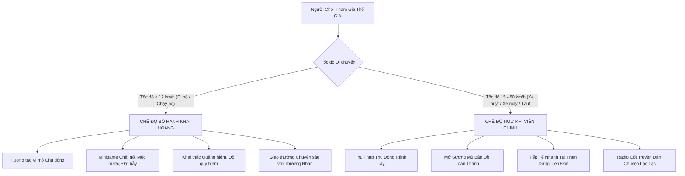

# KỊCH BẢN GAME & HỆ THỐNG ĐA PHƯƠNG THỨC DI CHUYỂN
# KỶ NGUYÊN HOANG CỔ (PRIMITIVE REALM) — BẢN THIẾT KẾ v2.1

> **Định vị:** Game Location-based Survival RPG Offline — Chơi đơn & Co-op gia đình  
> **Khẩu hiệu:** *"Bộ hành khai hoang — Ngự khí viễn chinh: Biến mỗi bước đi bộ và mỗi chuyến xe buýt thành hành trình sinh tồn tiền sử tráng lệ."*

---

## 1. THẾ GIỚI QUAN & TRIẾT LÝ NÂNG CẤP ĐA PHƯƠNG THỨC

### 1.1 Bối cảnh không gian "Đứt Gãy Không Gian" (The Spatial Rift)
Mười nghìn năm trước, một Đứt Gãy Không Gian bí ẩn đã xé toạc ranh giới thời gian, xếp chồng thế giới hoang sơ tiền sử (rừng rậm nguyên sinh, cự thú, mỏ khoáng cổ) lên trên bản đồ địa lý thực tế ngày nay. 
* Đường phố đô thị hiện đại trở thành các **"Cổ Đạo Vàng"**.
* Các trạm xe buýt, nhà ga trở thành các **"Tiền Đồn Cổ Đại"**.
* Công viên, bờ hồ trở thành **"Thánh Địa Linh Mộc & Thủy Vực"**.

### 1.2 Triết lý hai phương thức: "Bộ Hành" & "Ngự Khí"



* **Bộ Hành Khai Hoang (Đi bộ / Chạy bộ quanh nhà, công viên):**
  - **Mục tiêu:** Khai thác chiều sâu, tài nguyên tinh chế, đồ quý hiếm và xây dựng Căn Cứ.
  - **Hành động:** Chủ động dừng lại minigame, đặt bẫy bắt thú, câu cá, trao đổi công thức với Thương Nhân Cổ.
* **Ngự Khí Viễn Chinh (Đi xe buýt, metro, ngồi sau xe máy, ô tô trên đường đi làm/đi học):**
  - **Mục tiêu:** Mở rộng quy mô, gom góp tài nguyên đại trà, mở sương mù bản đồ (Fog of War) và thưởng thức cốt truyện kịch truyền thanh.
  - **Hành động:** Rảnh tay 100% (Hands-free), hệ thống tự động quét toạ độ thu thập thụ động, người chơi chỉ cần cắm tai nghe hoặc để điện thoại trong túi.

---

## 2. HỆ THỐNG GAMEPLAY CHI TIẾT KHI ĐI PHƯƠNG TIỆN

### 2.1 Cơ chế "Linh Điểu Thu Thập Thụ Động" (Passive Scavenging)
* **Ý tưởng cốt truyện:** Người chơi được bạn đồng hành AI Lạc Lạc trao cho một chú **Linh Điểu Tiền Sử** (hoặc Linh Thú Đồng Hành). Khi người chơi lên xe buýt/tàu điện lướt đi trên đường cái, Linh Điểu sẽ bay lượn trên tầng không để nhặt tài nguyên bị gió cuốn theo lộ trình.
* **Quy tắc vận hành:**
  - Không đòi hỏi người chơi chạm màn hình khi xe đang chạy.
  - Cứ mỗi **1 km di chuyển bằng phương tiện**, Linh Điểu tự động gom được: *1–2 Cành Khô, 1 Đá Nhọn, 1 Đất Sét hoặc Hạt Giống Cỏ*.
  - **Cân bằng Diminishing Returns & Trần hàng ngày:**
    - 0–10 km đầu/ngày: Nhận 100% tài nguyên thụ động.
    - 10–25 km tiếp theo: Nhận 50% tài nguyên thụ động + Tích lũy "Điểm Viễn Chinh" (dùng đổi skin trại và bản vẽ).
    - Trên 25 km: Chỉ mở sương mù bản đồ, ngưng rơi tài nguyên thô (tránh lạm phát do tài xế lái đường dài).

### 2.2 Hệ thống "Trạm Dừng Tiền Đồn" (Bus Stop & Metro Waypoints)
Game nhận diện các trạm dừng xe buýt và ga tàu điện thông qua dữ liệu OpenStreetMap:
* **Cửa sổ Tiếp Tế 30 giây:**
  Khi xe buýt tấp vào lề đón trả khách ($v \approx 0\text{ km/h}$ trong khoảng 20–60 giây):
  - Ứng dụng rung nhẹ (Haptic pulse) báo hiệu: **"Đã dừng tại Tiền Đồn [Tên Trạm]!"**
  - Người chơi chỉ cần 1 cú chạm nhanh để nhận **Rương Tiếp Tế Hành Trình** (Bình nước uống, quả chín, linh thạch tiếp tế).
  - Nếu không kịp bấm, Linh Điểu vẫn tự động check-in lưu lại nhật ký hành trình.

### 2.3 Mở Sương Mù Bản Đồ Đô Thị (Fog of War & Cartography)
* Mỗi tuyến xe buýt bạn đi qua (ví dụ: Tuyến xe 01, 02, 32, 08...) sẽ quét sạch sương mù che phủ dọc theo lộ trình bán kính 150m hai bên đường.
* Lộ trình này sẽ làm lộ diện trên bản đồ:
  - Vị trí các **Khu Rừng Cổ Đại Ẩn Giấu** (Công viên lớn).
  - Vị trí các **Mỏ Quặng Đứt Gãy** (Khu vực có địa hình đá tự nhiên).
  - Vị trí các **Lãnh Địa Boss Trăng Máu** để bạn có thể lên kế hoạch đi bộ đến chinh phục vào dịp cuối tuần.

---

## 3. KỊCH BẢN CỐT TRUYỆN 8 CHƯƠNG CHI TIẾT

Cốt truyện được thiết kế nhịp nhàng theo tuần. Người chơi có thể vừa đi bộ vừa đi xe buýt để mở khóa các beat truyện của Lạc Lạc.

### CHƯƠNG 1: ĐỐT LỬA LÚC CHẠNG VẠNG
* **Chủ đề:** Thức tỉnh, sinh tồn cơ bản và thiết lập Căn Cứ đầu tiên.
* **Cột mốc mở khóa:** Hoàn thành Tutorial 3 ngày đầu.
* **Kịch bản:** Người chơi tỉnh dậy giữa không gian méo mó. AI Lạc Lạc kết nối qua thiết bị cổ ngữ, hướng dẫn người chơi đi bộ gom cành cây, đá nhọn để nhóm ngọn lửa thiêng trước khi màn đêm buông xuống.
* **Nhiệm vụ chính:**
  - Đi bộ 1.500 bước quanh nhà.
  - Chế tạo 01 Rìu Đá & Đốt 01 Lửa Trại.
  - Thiết lập vị trí Doanh Trại Cấp 1 (Túp Lều Tranh).
* **Lời dẫn của Lạc Lạc:** *"Bạn có nghe thấy tiếng rì rào của rừng cổ thụ không? Không gian quanh khu phố của bạn đã biến chuyển rồi. Hãy tìm gỗ và đá trước khi ánh sáng cuối cùng tắt hẳn..."*

---

### CHƯƠNG 2: TIẾNG GỌI TỪ CỔ ĐẠO
* **Chủ đề:** Khai mở Linh Điểu & Kích hoạt Chế độ Du Hành Đường Xa (Xe buýt / Xe máy).
* **Cột mốc mở khóa:** Sau Đêm Trăng Máu tuần 1 + Đạt 10.000 bước tích lũy.
* **Kịch bản:** Khi người chơi bước lên một phương tiện di chuyển nhanh trên đại lộ chính, một con Linh Điểu Lửa thức tỉnh từ cổ phù. Lạc Lạc giải thích rằng các con đường nhựa thực chất là những dòng chảy linh khí nối liền các vùng đất.
* **Nhiệm vụ chính:**
  - Thực hiện 01 chuyến du hành > 3 km (bằng xe buýt hoặc xe máy).
  - Nhận tiếp tế tại 02 Trạm Dừng Tiền Đồn.
  - Mở khóa tính năng "Thu Thập Thụ Động".
* **Lời dẫn của Lạc Lạc (Radio khi đi xe):** *"Gió đang rít qua tai bạn! Khi bạn di chuyển với tốc độ của loài chim ưng, Linh Điểu sẽ gom lấy những mảnh linh khí rơi rụng. Cứ yên tâm ngắm nhìn đường phố, tôi sẽ canh chừng hành trình cho bạn."*

---

### CHƯƠNG 3: NHỮNG TIỀN ĐỒN BÊN VÀNH ĐAI
* **Chủ đề:** Khám phá mạng lưới thương nhân và điểm trung chuyển đô thị.
* **Cột mốc mở khóa:** Sau Đêm Trăng Máu tuần 2 + Nâng cấp Doanh Trại Cấp 2 (Nhà Sàn Gỗ).
* **Kịch bản:** Người chơi phát hiện các trạm xe buýt và nhà ga dọc đường đi làm hàng ngày là nơi tụ hội của Thương Đoàn Cổ Lang Thang.
* **Nhiệm vụ chính:**
  - Check-in tại 5 Tiền Đồn Trạm Dừng khác nhau.
  - Chế tạo 01 Lò Nung Đất Nung tại trại.
  - Đổi hạt giống quý tại Thương Nhân Cổ.
* **Lời dẫn của Lạc Lạc:** *"Mỗi điểm dừng chân của chuyến xe là một điểm giao thoa giữa quá khứ và hiện tại. Những món đồ tiếp tế đang nằm chờ bạn trong hộp thư tiền đồn!"*

---

### CHƯƠNG 4: BÃO LINH KHÍ & VỆT ĐỨT GÃY
* **Chủ đề:** Mở rộng bản đồ đô thị và chinh phục vùng nước hoang dã.
* **Cột mốc mở khóa:** Sau Đêm Trăng Máu tuần 3 + Khám phá 10 km đường viễn chinh.
* **Kịch bản:** Đứt gãy mở rộng sang các dòng sông lớn (Sông Hồng, Sông Tô Lịch, Hồ Tây). Nước ngọt tinh khiết trở thành nguồn sống then chốt cho căn cứ.
* **Nhiệm vụ chính:**
  - Đi bộ tiếp cận 01 POI Vùng Nước (Hồ hoặc Sông).
  - Đặt 02 Bẫy Cá và thu hoạch Cá Nướng.
  - Mở sương mù bản đồ 3 quận/khu vực thông qua các chuyến xe buýt hàng ngày.
* **Lời dẫn của Lạc Lạc:** *"Dòng nước phía trước chứa đầy tinh hoa cổ đại. Hãy lấy nước sạch và đun sôi, cơ thể bạn sẽ cần nguồn năng lượng dồi dào cho những chuyến đi dài hơn."*

---

### CHƯƠNG 5: THỢ RÈN CỔ & THƯƠNG ĐOÀN VIỄN DU
* **Chủ đề:** Nâng cấp thời kỳ Đồ Sắt & Vũ khí phòng thủ pháo đài.
* **Cột mốc mở khóa:** Sau Đêm Trăng Máu tuần 4 + Thu thập 15 Quặng Sắt.
* **Kịch bản:** Lạc Lạc tìm thấy bản vẽ của Thợ Rèn Cổ. Người chơi cần thu thập quặng sắt từ các chuyến xe viễn chinh và gỗ lớn từ công viên để đúc vũ khí sắt.
* **Nhiệm vụ chính:**
  - Chế tạo Lò Rèn & Đúc 05 Thỏi Sắt.
  - Chế tạo Cung Tên Sắt & Giáo Sắt.
  - Xây dựng Tháp Canh Gỗ tại Căn Cứ.
* **Lời dẫn của Lạc Lạc:** *"Tiếng búa rèn đã vang lên trong trại của chúng ta! Sắt thép sẽ bảo vệ chúng ta khỏi những đợt sóng bóng tối hung hãn nhất."*

---

### CHƯƠNG 6: VẾT NỨT ĐÊM TRĂNG MÁU
* **Chủ đề:** Đại chiến phòng thủ pháo đài & Nâng cấp Trại Cấp 3 (Pháo Đài Đá Cổ).
* **Cột mốc mở khóa:** Sau Đêm Trăng Máu tuần 5 + Đạt Doanh Trại Cấp 3.
* **Kịch bản:** Đêm Trăng Máu trở nên dữ dội hơn khi Cự Thú Đầu Đàn xuất hiện. Toàn bộ công trình phòng thủ, tháp canh, nỏ máy Ballista được huy động.
* **Nhiệm vụ chính:**
  - Lắp đặt 01 Nỏ Máy Ballista trên tường đá.
  - Đánh bại Boss Trăng Máu Cấp 3 trong khung giờ thứ Bảy (hoặc đánh bù sáng Chủ nhật).
  - Hoàn thành 1 chuyến tuần tra viễn chinh cuối tuần.
* **Lời dẫn của Lạc Lạc:** *"Trăng Máu đã nhuộm đỏ cả bầu trời. Hãy đứng vững sau chiến lũy đá, các nỏ máy đã nạp đạn sẵn sàng!"*

---

### CHƯƠNG 7: TINH HOA VẠN DẶM
* **Chủ đề:** Thu thập 4 Mảnh Linh Thạch Thời Không trên khắp thành phố.
* **Cột mốc mở khóa:** Sau Đêm Trăng Máu tuần 6 + Mở sáng 50% bản đồ thành phố.
* **Kịch bản:** Để vá lại Đứt Gãy Không Gian, người chơi phải thu thập 4 mảnh Linh Thạch được rải rác ở 4 phương Đông - Tây - Nam - Bắc của thành phố. Đây là chương tôn vinh các chuyến đi xa bằng xe buýt và metro.
* **Nhiệm vụ chính:**
  - Du hành đến 4 tiền đồn ở 4 hướng khác nhau của thành phố.
  - Kết hợp 4 Mảnh Linh Thạch tại Lò Rèn Thần Cổ.
  - Dự trữ đủ 50 Lương Khô và 50 Nước Sạch cho trận chiến cuối cùng.
* **Lời dẫn của Lạc Lạc:** *"Bốn mảnh đá cổ đang phát sáng đồng điệu. Những dặm đường bạn đã đi qua suốt những tuần qua không hề vô ích — bản đồ của chúng ta đã gần như hoàn thiện!"*

---

### CHƯƠNG 8: VÁ LẠI ĐỨT GÃY KHÔNG GIAN (ĐẠI KẾT CỤC)
* **Chủ đề:** Nghi lễ Vá Trời & Khai mở Chế Độ Vô Tận (Endless Mode).
* **Cột mốc mở khóa:** Sau Đêm Trăng Máu tuần 7 + Có đủ 4 Linh Thạch.
* **Kịch bản:** Tại trung tâm Căn Cứ, người chơi kích hoạt Trụ Phong Ấn Không Gian. Trận chiến sinh tử với Chúa Tể Đứt Gãy diễn ra. Sau khi chiến thắng, không gian được hàn gắn trở lại, mở ra thế giới thanh bình và Chế Độ Vô Tận cho người chơi tiếp tục khám phá tự do.
* **Nhiệm vụ chính:**
  - Kích hoạt Trụ Phong Ấn.
  - Đánh bại Boss Cuối: Cự Long Không Gian.
  - Mở khóa Huy Hiệu "Người Vá Trời Đại Cổ" & Mở Chế độ Vô Tận trọn đời.
* **Lời dẫn của Lạc Lạc:** *"Chúng ta đã làm được! Đứt gãy đã khép lại, nhưng vùng đất trù phú này giờ đây là ngôi nhà vĩnh cửu của bạn. Hãy tiếp tục bước đi và du hành, thế giới này luôn chào đón bạn!"*

---

## 4. KỊCH BẢN RADIO RẢNH TAY CỦA LẠC LẠC (AUDIO GUIDE FOR COMMUTERS)

Khi người chơi ngồi trên xe buýt hoặc tàu điện, Lạc Lạc tự động phát các đoạn thuyết minh ngắn (60–90 giây) kèm nhạc nền tiền sử hùng tráng và tiếng gió vi vu:

```
[RADIO ĐOẠN 1 — Khi xe buýt qua Cầu Vượt Sông]:
"Lạc Lạc đây! Xe của bạn đang vượt qua một dòng sông lớn. Nhìn mặt nước phía dưới xem — trong thế giới 10.000 năm trước, đây là Thủy Vực Thần Long, nơi sinh sống của những đàn cá vảy bạc khổng lồ. Linh Điểu của bạn vừa vớt được một nhánh rong biển linh khí đấy!"

[RADIO ĐOẠN 2 — Khi xe buýt dừng đón trả khách]:
"Chúng ta vừa dừng bánh tại Tiền Đồn Trạm Dừng! Tôi cảm nhận được có một hộp tiếp tế của Thương Đoàn để lại gần đây. Nếu rảnh tay, bạn có thể nhận nhanh; nếu bận, Linh Điểu sẽ tự động lưu lại điểm mốc này cho bạn nhé."

[RADIO ĐOẠN 3 — Khi xe buýt chạy qua Khu Phố Cổ / Di Tích]:
"Vùng đất bạn đang đi qua từng là một Hoàng Thành cổ kính dưới thời tiền sử. Tốc độ di chuyển của bạn đang giúp xóa tan những mảng sương mù dày đặc trên bản đồ. Toàn bộ khu vực này đã được ghi chép vào Cổ Đồ của Căn Cứ!"
```

---

## 5. BẢNG CÂN BẰNG TÀI NGUYÊN & AN TOÀN TUYỆT ĐỐI

| Phương thức di chuyển | Tốc độ | Thao tác người chơi | Sản lượng tài nguyên | Giới hạn an toàn |
|---|---|---|---|---|
| **Đi bộ / Chạy bộ** | 0.5 – 10 km/h | Chủ động tương tác màn hình, bấm minigame, đặt bẫy, chặt gỗ | Tài nguyên tinh chất cao (Gỗ lớn, Đá tảng, Quặng sắt, Cá tươi, Thịt thú) | An toàn cao, tự do dừng chân |
| **Xe buýt / Metro / Ô tô** | 15 – 60 km/h | Rảnh tay (Hands-free), cắm tai nghe nghe radio, nhận rương khi xe đỗ | Tài nguyên đại trà (Cành khô, Đá nhọn, Đất sét, Hạt giống, Điểm Viễn Chinh) | **Khóa mọi minigame phức tạp khi xe đang chạy**, chỉ mở tương tác nhanh 30s khi $v = 0$ km/h |

---

## 6. KẾT LUẬN

Bản thiết kế kịch bản v2.1 này giải quyết triệt để vấn đề "ít người đi bộ", biến thời gian ngồi xe buýt/xe máy mỗi ngày thành một phần gameplay hấp dẫn, văn minh, bổ ích và an toàn tuyệt đối cho mọi người chơi tại Việt Nam.
